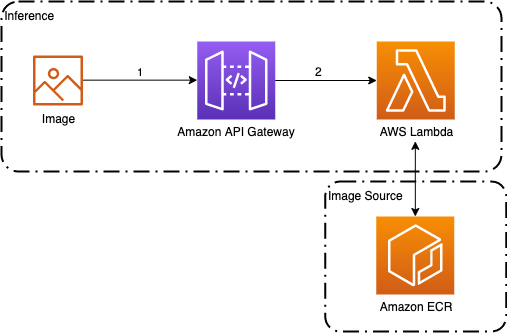
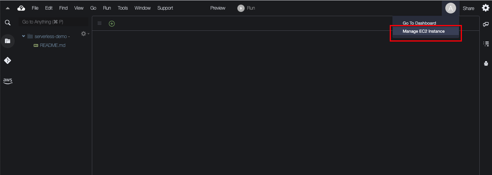
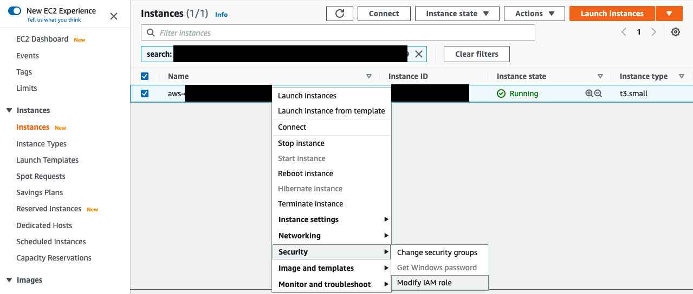
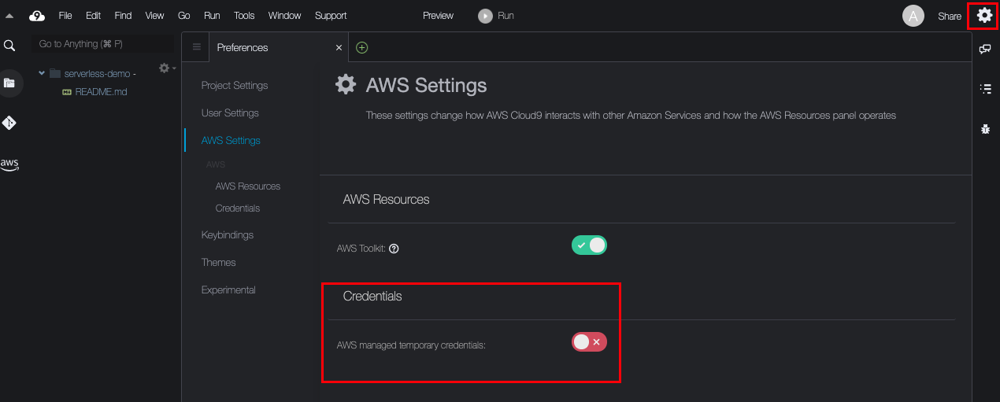

# Serverless Inference with PyTorch

This is a sample project to create a Serverless Inference using AWS Lambda (container) + PyTorch.



0. Amazon ECR is used as image source to deploy image on Lambda.
1. User send a image URL to API Gateway (HTTP);
2. API Gateway send request to lambda, which load pre-trained model, do inference on image and return predicted label to user.

This example is based on [Caltech256](http://www.vision.caltech.edu/Image_Datasets/Caltech256/) public dataset. From this dataset, 4 classes was chosen to be predicted by this model:

* 010.beer-mug
* 041.coffee-mug
* 212.teapot
* 246.wine-bottle

There is this [notebook](generate-model.ipynb) with a step by step to download Caltech256 dataset, organize images, train a model and save (export) model file to model directory.

Model was created using [PyTorch](https://pytorch.org/).

### AWS Cloud9

#### Creating AWS Cloud9 environment

[AWS Cloud9](https://aws.amazon.com/pt/cloud9/) is online IDE to develop, execute and debug code.

We're going to create a Cloud 9 environment, to simplify deployment.

Create a Cloud9 environment and expand disk with following command (because of docker images size):

```
pip3 install --user --upgrade boto3
export instance_id=$(curl -s http://169.254.169.254/latest/meta-data/instance-id)
python -c "import boto3
import os
from botocore.exceptions import ClientError 
ec2 = boto3.client('ec2')
volume_info = ec2.describe_volumes(
    Filters=[
        {
            'Name': 'attachment.instance-id',
            'Values': [
                os.getenv('instance_id')
            ]
        }
    ]
)
volume_id = volume_info['Volumes'][0]['VolumeId']
try:
    resize = ec2.modify_volume(    
            VolumeId=volume_id,    
            Size=50
    )
    print(resize)
except ClientError as e:
    if e.response['Error']['Code'] == 'InvalidParameterValue':
        print('ERROR MESSAGE: {}'.format(e))"
if [ $? -eq 0 ]; then
    sudo reboot
fi

```

#### Creating IAM Role

Create an [IAM Role](https://docs.aws.amazon.com/IAM/latest/UserGuide/id_roles_create.html) with AdministratorAccess policy attached. 

**This is an example only, on real case scenario you should not work with AdministratorAccess**

Add this role on your Cloud9 environment:

On the top of your Cloud9 env, click on "A" letter and choose "Manage EC2 Instance":



On EC2 console, right click into your EC2, choose "Security" and then "Modify IAM Role"



Choose your role and save it.

After this, disable "AWS managed temporary credentials" option on Cloud9 env, by clicking on right top corner, engine icon, navigate to "AWS Settings" and uncheck **AWS managed temporary credentials** :



Check if environment is using new created role:

```
aws sts get-caller-identity
```

**This command should return your role.**

### Install Docker and SAM

Check if docker and SAM are installed:

```
docker --version

sam --version
```

If they are not installed, follow official documentation to install:

* [Docker](https://docs.docker.com/get-docker/)
* [AWS SAM](https://aws.amazon.com/serverless/sam/)

### Clone this repo

Clone this repo on your Cloud9 environment:

```
git clone https://github.com/aws-samples/aws-lambda-container-inference-pytorch.git

cd aws-lambda-container-inference-pytorch
```

### Setup AWS Region

Setup your AWS Region (where you would like to deploy resources, for example):

```
export AWS_DEFAULT_REGION=us-east-1
```

### Create an ECR repository

[Amazon Elastic Container Registry (ECR)](https://aws.amazon.com/ecr/) is a fully managed container registry on AWS.

Following command  will create a new repo to store your custom container:

```
aws ecr create-repository --repository-name lambda-serverless-inference --image-scanning-configuration scanOnPush=true
```

**Tip: store the value of repositoryUri and ECR url on following env vars:**

```
export REPO_URI=<your repo uri>
export ECR_URL=<AWS_ACCOUNT_ID>.dkr.ecr.<REGION>.amazonaws.com
```

### Login on ECR Repo

Log into ECR, on your Cloud9 env:

```
aws ecr get-login-password | docker login --username AWS --password-stdin $ECR_URL
```

### Sam Deploy

Run following commands to generate docker image, push it to ECR, and deploy Lambda and API Gateway (HTTP) using SAM:

```
sam build

sam deploy -g
```

Whenever asked, enter $REPO_URI information on repository info.

### Testing

```
export API_GW_URL=<API_GATEWAY_URL>

curl $API_GW_URL?url=https://path/to/image/on/web.jpg
```

**Tip: Do not forget your API Gateway path (/inference for example) at the end of API GW url**

### Cleaning up

1. SAM will create a Cloud Formation Stack. Click on **Delete** to Destroy Cloud Formation Stack. It will delete API Gateway and Lambda.

2. Delete ECR repo.

3. Delete Cloud9 environment

## Security

See [CONTRIBUTING](CONTRIBUTING.md#security-issue-notifications) for more information.

## License

This library is licensed under the MIT-0 License. See the LICENSE file.

## Questions?

Please raise an issue on this repo.